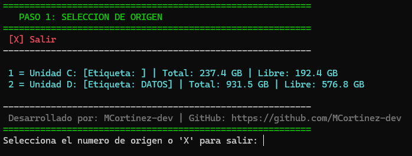
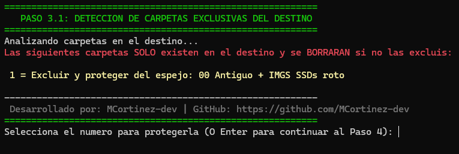

# Asistente Interactivo de Respaldo Universal (TUI)

Un script interactivo en PowerShell diseñado para simplificar y automatizar la ejecución de copias de seguridad unificando tres entornos críticos: almacenamiento local/externo, red local (SMB) y servidores remotos a través de Tailscale SSH y Rsync.

---

### 🥟 En criollo ¿Para qué sirve esto?

¿Querés hacer copias de seguridad de tus archivos importantes pero estás cansado de programas pagos, pesados o llenos de publicidad que andan Dios sabe qué haciendo con tus datos en segundo plano? Con este script resolvés exactamente lo mismo usando herramientas nativas y transparentes. 

Ya sea que quieras resguardar tus fotos en un disco externo USB que tenés arriba del escritorio, tirar un backup automatizado a una carpeta compartida en la red local de tu casa (SMB), o mandar tu información a través de una VPN (como Tailscale) a un servidor o HomeLab Linux que está en la otra punta del mundo vía SSH... este asistente te guía paso a paso sin que tengas que acordarte de memoria de comandos larguísimos ni flags complejas. Es prender, elegir las opciones en pantalla, y dejar que trabaje.

---

## 🚨 ADVERTENCIA CRÍTICA: Modo Espejo Estricto

Este asistente está diseñado bajo la filosofía de **Sincronización en Espejo Estricto**, utilizando los modificadores `/MIR` en Robocopy y `--delete` en Rsync. 

> ⚠️ **¿Qué significa esto?** 
> El directorio de destino pasará a ser una copia **idéntica e incremental** del origen. Si tenés carpetas o archivos guardados en el disco/servidor de destino que **NO** existen en el origen (y no los agregás explícitamente a la lista de exclusiones durante el Paso 3.1), **el script los eliminará permanentemente** para emparejar ambos directorios. 
> 
> *Siempre revisá con atención el Paso 3.1 (Detección de Huérfanos) antes de confirmar la ejecución en el Paso 4.*

---

## 🚀 Características

*   **Interfaz de Consola (TUI):** Flujo guiado paso a paso con manejo de estado nativo en PowerShell.
*   **Detección Automática de Hardware:** Mapea las unidades fijas locales, tamaños y espacio libre en tiempo real.
*   **Exclusiones Inteligentes:** Permite seleccionar directorios dinámicamente y formatea las rutas complejas con espacios para evitar fallas en los motores de copia.
*   **Detección y Protección Remota (Nuevo):** Escanea el servidor SSH remoto en busca de directorios exclusivos para protegerlos antes de aplicar el espejo.
*   **Motor Dual Robocopy / Rsync:**
    *   Usa **Robocopy** con modificadores de espejo (`/MIR`) y reanudación automática para entornos Windows y redes SMB.
    *   Usa **Rsync** estructurado sobre SSH para transferencias eficientes hacia servidores remotos (ideal para infraestructuras Linux/HomeLabs sobre Tailscale).

---

## 📸 Screenshots & Demo

Aquí podés ver el flujo interactivo del asistente en acción:

#### Paso 1: Selección de Origen


*El asistente lista los discos físicos locales detectados y su espacio libre.*

#### Paso 3.1: Detección de Huérfanos en Destino (Rsync / SSH)


*El script lee el servidor remoto a través de Tailscale y advierte qué carpetas se borrarían si no las protegés.*

---

## 🛠️ Requisitos

*   Windows 10/11 con PowerShell 5.1 o superior.
*   Para respaldos remotos: Tailscale activo y configuración de SSH habilitada en el destino.

---

## 📦 Instalación y Uso

1. Clona este repositorio:
   ```bash
   git clone [https://github.com/MCortinez-dev/PS-TUI-Respaldo-Universal.git](https://github.com/MCortinez-dev/PS-TUI-Respaldo-Universal.git)
## 📦 Instalación y Uso
1. Clona este repositorio:
   ```bash
   git clone [https://github.com/MCortinez-dev/PS-TUI-Respaldo-Universal.git](https://github.com/MCortinez-dev/PS-TUI-Respaldo-Universal.git)
   ```
2. Abre una terminal de PowerShell como Administrador, navega a la carpeta y ejecuta:

   ```PowerShell
   Set-ExecutionPolicy Bypass -Scope Process .\respaldo-universal.ps1
   ```
📄 Historial de Cambios y Licencia
Para ver las novedades de la última versión v2.0.0, revisá el CHANGELOG.md.

Distribuido bajo la Licencia MIT.

Desarrollado con 💪 por MCortinez-dev
